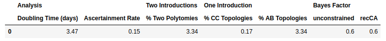

### Modified code to fix errors, suppress noise and correct the inconsistency in the clade size requirement

[stableCoalescence_cladeAnalysis.py](https://github.com/nizzaneela/multi-introduction/blob/corrected/FAVITES-COVID-Lite/scripts/stableCoalescence_cladeAnalysis.py) is modified to correct determination of the stable coalescence, and to resample the mutation simulation 1000 times.

[cladeAnalysis.ipynb](https://github.com/nizzaneela/multi-introduction/blob/corrected/notebooks/cladeAnalysis.ipynb) is modified to generate corrected transmission times, sample times and time trees, to run `stableCoalescence_cladeAnalysis.py` for each simulation, and to analyse the clades generated by each resample.

#### Instructions

Fetch the data from Zenodo:
```
for i in {01..22}; do wget "https://zenodo.org/records/6899613/files/simulations_${i}.zip?download=1" -O "simulations_${i}.zip"; done
```

Unpack the data into a subdirectory `simulations`:
```
mkdir -p ./simulations
parallel 'unzip "{}" -d . && mv "{/.}"/* ./simulations && rmdir "{/.}"' ::: simulations_*.zip
```

Get [stableCoalescence_cladeAnalysis.py](https://github.com/nizzaneela/multi-introduction/blob/corrected_with_relative_size_condition/FAVITES-COVID-Lite/scripts/stableCoalescence_cladeAnalysis.py) and [cladeAnalysis.ipynb](https://github.com/nizzaneela/multi-introduction/blob/corrected_with_relative_size_condition/notebooks/cladeAnalysis.ipynb) from this branch:
```
curl -L -o stableCoalescence_cladeAnalysis.py "https://raw.githubusercontent.com/nizzaneela/multi-introduction/corrected_with_relative_size_condition/FAVITES-COVID-Lite/scripts/stableCoalescence_cladeAnalysis.py"
curl -L -o cladeAnalysis.ipynb "https://raw.githubusercontent.com/nizzaneela/multi-introduction/corrected_with_relative_size_condition/notebooks/cladeAnalysis.ipynb"
```

Get `coatran_constant` from [CoaTran](https://github.com/niemasd/CoaTran/tree/main):
```
git clone https://github.com/niemasd/CoaTran.git
cd CoaTran
make
sudo mv coatran_constant /usr/local/bin/
```

Launch the notebook. The number of processers to be used in parallel can be set with the `max_workers` parameter in cells 5 and 11. The note book can then be run to reproduce the result below.




### Supplementary code for:

J. E. Pekar, A. Magee, E. Parker, N. Moshiri, K. Izhikevich, J. L. Havens, K. Gangavarapu, L. M. Malpica Serrano, A. Crits-Christoph, N. L. Matteson, M. Zeller, J. I. Levy, J. C. Wang, S. Hughes, J. Lee, H. Park, M.-S. Park, K. Ching Zi Yan, R. T. Pin Lin, M. N. Mat Isa, Y. M. Noor, T. I. Vasylyeva, R. F. Garry, E. C. Holmes, A. Rambaut, M. A. Suchard, K. G. Andersen, M. Worobey, J. O. Wertheim, "The molecular epidemiology of multiple zoonoses of SARS-CoV-2".
